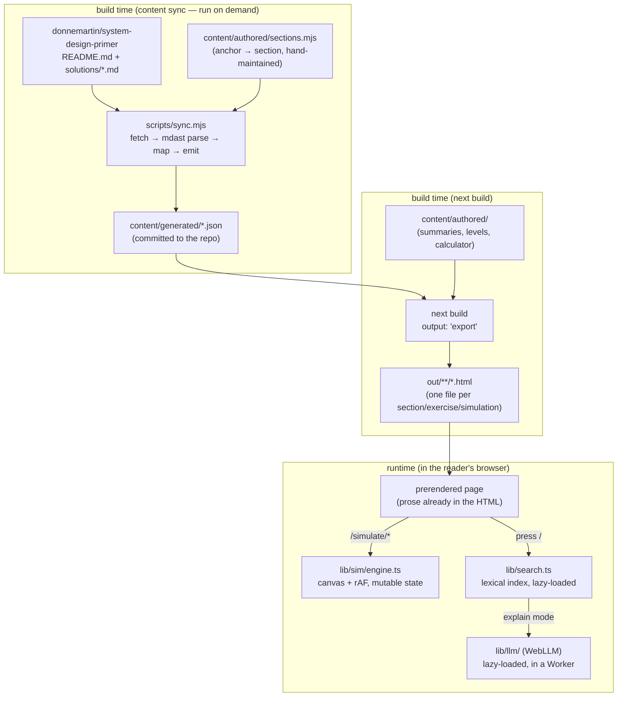

# Architecture

What this is built with, where each piece lives, and how a page actually gets
to the reader. For *why* a given choice was made, see [`docs/adr/`](docs/adr/)
— this document says what and where, the ADRs say why.

## Stack

| Layer | Tech | Where |
|---|---|---|
| Framework | Next.js 16 (App Router), static export | `app/`, `next.config.mjs` |
| UI | React 19, CSS Modules | `app/`, `components/` |
| Language | TypeScript | everywhere except `scripts/` and `content/authored/`, which are plain `.mjs` |
| Content sync | Node.js script, `mdast-util-from-markdown` + GFM | `scripts/sync.mjs` |
| Simulation engine | Hand-written, `<canvas>` + `requestAnimationFrame`, no library | `lib/sim/engine.ts` |
| Search | Hand-written lexical index (no dependency) | `lib/search.ts` |
| On-device explain | WebLLM (`@mlc-ai/web-llm`), `Llama-3.2-1B-Instruct-q4f16_1-MLC`, in a Web Worker | `lib/llm/` |
| Hosting | Vercel, deployed from `main` via the GitHub integration | — |
| Analytics | Vercel Analytics + Speed Insights, cookieless | `app/layout.tsx` |
| CI | GitHub Actions — typecheck, level tuning, browser smoke test, WCAG 2.2 AA audit | `.github/workflows/ci.yml` |

Node **24**, pinned in `.nvmrc`, `package.json#engines`, and both workflows —
see [CLAUDE.md § Node](CLAUDE.md#node) for why that has to stay in sync.

No backend, no database, no API routes. The reasoning is
[ADR-0001](docs/adr/0001-static-export-standalone-repo.md).

## Directory map

```
content/
  authored/       hand-written: summaries, simulation definitions, latency figures,
                   the section-to-upstream-anchor mapping — never touched by the sync
  generated/       sync output (reference.json, exercises.json, nav.json,
                   search-index.json, meta.json) — committed, never hand-edited
  index.ts         full content (section/exercise bodies) — server components only
  nav.ts           titles + slugs only — what client components import

scripts/
  sync.mjs           fetch → parse → map → emit (content/authored → content/generated)
  verify-levels.mjs  headless simulation tuning check
  smoke.mjs          Playwright browser smoke test
  a11y.mjs           WCAG 2.2 AA audit (axe-core + custom checks)
  sim-harness.mjs    bundles lib/sim/engine.ts for Node, so verify-levels runs
                     the same engine code the browser does

lib/
  sim/engine.ts    the simulation — plain class, mutable state, rAF loop
  search.ts        lexical search index, shared by find-mode and LLM retrieval
  llm/             WebLLM wrapper + worker entry point
  types.ts         shared TypeScript types

components/        React components + their CSS Modules (Shell, Simulation,
                   Blocks, AskOverlay, AvailabilityCalculator, LatencyChart, …)

app/
  layout.tsx           root layout: fonts, theme bootstrap script, analytics
  page.tsx             landing page
  reference/[slug]/    one page per synced primer section
  exercise/[slug]/     one page per design-problem exercise
  simulate/[slug]/     one page per simulation

docs/
  adr/             architecture decision records — the "why" behind the
                   non-obvious choices below
  media/           screenshots used in the README

.github/workflows/
  ci.yml           typecheck, level tuning, build, smoke test, a11y audit
  sync.yml         manual content refresh (see ADR-0002's addendum)
```

## How a page gets built

Two separate processes, and it matters which one you're changing.



A mapped anchor that disappears upstream **fails the sync**, not the site — see
[ADR-0002](docs/adr/0002-content-sync-from-upstream.md). Content refresh is
manual, not scheduled; see that ADR's 2026-08-17 addendum for why.

## Runtime, in one paragraph

Everything in `out/` is static HTML, CSS and JS — there is nothing to run on a
server. Once loaded, three things happen client-side and independently:

- **Simulations** run on `<canvas>`, driven by `requestAnimationFrame`, with
  packet state held outside React entirely
  ([ADR-0003](docs/adr/0003-simulation-outside-react-state.md)) — a few hundred
  objects re-rendering through React each frame would not hold 60fps.
- **Search** (`/`) lazily fetches a ~160 KB lexical index and ranks against it
  locally. No network call, no server.
- **Explain mode** lazily imports WebLLM and runs a 879 MB model in a Web
  Worker, so the download and inference never block the main thread or the
  canvas ([ADR-0004](docs/adr/0004-on-device-llm-in-a-worker.md)). Nothing you
  type is sent anywhere in any mode.

## Two content bundles, on purpose

`content/index.ts` (full section bodies, ~770 KB) is for **server components
only**. `content/nav.ts` (titles and slugs) is what **client components**
import — the persistent sidebar, the simulation cross-links. Importing the
wrong one from a client component has regressed the bundle size once already;
see [ADR-0006](docs/adr/0006-split-content-and-nav-bundles.md) and the note in
[CLAUDE.md](CLAUDE.md#things-that-will-bite-you).

## Quality gates

Four checks, all run in CI on every push:

| Command | What it catches |
|---|---|
| `npm run typecheck` | type errors |
| `npm run verify:levels` | a simulation that can be won without teaching its lesson — runs each level 12× headlessly through the same engine the browser uses |
| `npm run smoke` | anything that only breaks in a real browser — canvas painting, meters moving, the ask overlay, theme persistence |
| `npm run a11y` | WCAG 2.2 AA regressions — axe-core plus target size, reflow at 320px, text spacing, keyboard reach |

`npm run verify` runs the first two. Before opening a PR:
`npm run verify && npm run build && npm run smoke && npm run a11y`.
