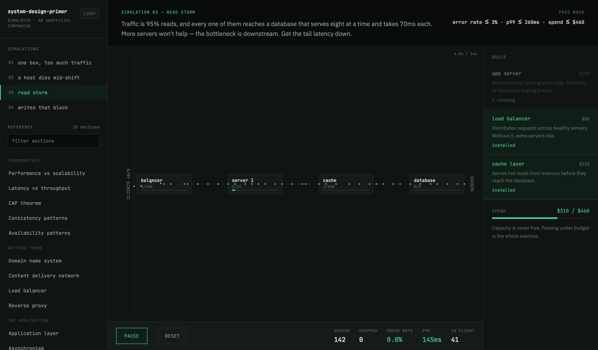
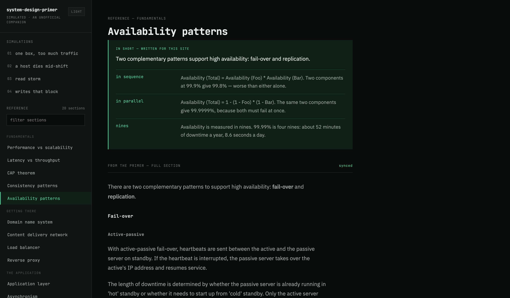

# system-design-primer (web)

**An interactive companion to [donnemartin/system-design-primer](https://github.com/donnemartin/system-design-primer)** — an independent project, not affiliated with or endorsed by its authors. Content is reused under CC BY 4.0.

**→ https://system-design-primer.rujalduwal.com.np**

The primer is one of the best pieces of writing on system design, and it is a single ~110 KB README: no navigation, no search, no way to link to one topic. [Issue #1363](https://github.com/donnemartin/system-design-primer/issues/1363) asks for a website. This is one answer to it.



## Three modes

- **6 simulations** — a live packet-flow model. You get traffic, a broken topology, an objective and a budget. Buy parts, run the traffic, and find out which node pinned at capacity. The lesson is in the failure, not the diagram — and in the last one, in choosing which guarantee to give up.
- **20 reference sections** — each with its own URL, a summary written for this site, and the primer's full text below it.
- **7 exercises** — the design problems, with their constraints and the four-step method as progressive reveals. Step one is open; the rest stay shut so you can attempt before reading.

Plus local full-text search over all 27 documents, and an opt-in on-device LLM that explains sections with nothing leaving the browser.



## The content contract

This is the constraint the whole project is built around:

> **Contributors update the primer's README, and this site must not deviate from it.**

So every page is split visibly, and the split is the point:

| Zone | Source | Marked in the UI as |
|---|---|---|
| Summary panel | Written for this site | `in short — written for this site` |
| Body | The primer's markdown, rebuilt from source | `from the primer — full section` |

`scripts/sync.mjs` fetches `README.md` and the seven solution files, parses them to an AST, splits them on an explicit mapping table, rewrites internal anchors to local routes, vendors the images, and emits the JSON the site renders. A mapped anchor that disappears upstream **fails the build** — a section going missing must never be silent.

The sync never touches the authored half: section keys, slugs, groups, summary panels, the simulation definitions, the availability calculator, or the latency chart. Those live in `content/authored/`.

Refreshing is **manual**, by design: run `npm run sync` locally, or trigger the
*sync content from the primer* workflow, which rebuilds in a clean environment,
verifies the build, and pushes a branch to review if anything actually changed.
`meta.json` carries a hash of the emitted content, so an unchanged upstream is a
true no-op rather than a timestamp bump.

The trade-off is real and worth naming: between runs this site can fall behind
the README it rebuilds from. Every page shows the date it was last synced.

## Running it

```bash
npm install
npm run sync      # fetch upstream content (--offline reuses .cache/)
npm run dev       # http://localhost:3000
```

Requires Node 24 (see `.nvmrc`).

```bash
npm run build     # static export to out/ — one HTML file per section
npm run verify    # typecheck + simulation tuning
npm run smoke     # browser tests against out/ (run build first)
```

### Two checks worth knowing about

**`npm run verify:levels`** runs every simulation headlessly, 12 times per case, and asserts that each one *fails* with the starting build and *passes* with the intended one. A simulation that can be won without its lesson has stopped teaching, and nothing in the UI would tell you. It bundles and runs the same engine the browser does, so it cannot drift from what readers experience.

**`npm run smoke`** drives the built export in Chromium: the canvas paints, meters move under load, buying a part resets the run, `/` opens search and Enter opens the top hit, the theme survives a reload, and 375px has no horizontal overflow.

**`npm run a11y`** audits against WCAG 2.2 Level AA — axe-core over every page type in both themes, plus the things axe cannot check on its own: 24px target sizes (2.5.8), reflow at 320px (1.4.10), the spec's text-spacing override (1.4.12), and keyboard reach of the simulation controls (2.1.1).

All three run in CI on every push and pull request.

## Layout

```
content/
  authored/     summaries, simulations, latency figures, section mapping — hand-written
  generated/    sync output — committed so the site builds without network
  index.ts      full content, for pages that render bodies
  nav.ts        titles and slugs only, for client components
scripts/
  sync.mjs           fetch → parse → map → emit
  verify-levels.mjs  simulation tuning check
  smoke.mjs          browser smoke test
  a11y.mjs           WCAG 2.2 AA audit
lib/
  sim/engine.ts  the simulation — plain class, mutable refs, rAF
  search.ts      lexical index, shared by search and LLM retrieval
  llm/           WebLLM in a worker
app/             reference/[slug], exercise/[slug], simulate/[slug]
docs/adr/        why things are the way they are
```

## Design notes

The reasoning behind the non-obvious choices is in [`docs/adr/`](docs/adr/), written so that whoever changes them knows what they are trading away. In short:

- **Static export, no backend.** Every section is a prerendered HTML file, so deep links and search engines both see real content. That is the actual fix the issue asked for. ([ADR-0001](docs/adr/0001-static-export-standalone-repo.md))
- **Content is rebuilt from source, never copied.** Otherwise the site becomes a fork of the primer's text and quietly rots. ([ADR-0002](docs/adr/0002-content-sync-from-upstream.md))
- **Packets never enter React state.** A few hundred objects re-rendering per frame will not hold 60fps, so the engine owns them and reports metrics eight times a second. ([ADR-0003](docs/adr/0003-simulation-outside-react-state.md))
- **The model runs in a worker, lazily.** `Llama-3.2-1B-Instruct-q4f16_1-MLC`, 879 MB, opt-in behind a gate that states the cost first. Search works without it. ([ADR-0004](docs/adr/0004-on-device-llm-in-a-worker.md))
- **Nothing upstream is injected as HTML.** The sync emits a block tree and the renderer builds React elements from it.

## Accessibility

Conforms to **WCAG 2.2 Level AA**, enforced in CI rather than asserted here.

Some of what that took: the small uppercase labels used a grey that read at
3.1:1 and now clear 4.5:1; control boundaries have their own token so they meet
3:1 without turning the design's hairline rules into borders; simulation pages
gained a real `<h1>`; upstream heading levels are renumbered during the sync so
the outline never skips a level; links in prose are underlined rather than only
tinted; and every standalone link meets the 24px target minimum.

The simulation canvas is not usable without sight. It carries a text
description of the current topology and a live region announcing served,
dropped, error rate, p99 and stale counts as the run proceeds, so the outcome
and the reason for it are available without the picture.

## Privacy

Cookieless pageview and Core Web Vitals counts via Vercel Analytics — no cookies,
no personal data, no cross-site tracking. Search runs against a local index and
the optional model runs in your tab, so **what you type into the search overlay
never leaves the browser**.

## Contributing

One thing worth knowing before you open a PR:

**Corrections to the system design material belong upstream, not here.** Section
bodies and exercise steps are rebuilt from
[donnemartin/system-design-primer](https://github.com/donnemartin/system-design-primer)
on every sync, so a fix made in this repo would be overwritten the next time it
runs — and would put this site out of step with the source it credits. Send those
to the primer; they will arrive here on their own.

What does belong here: the application, the sync, the simulations, the authored
summaries in `content/authored/`, bugs, and accessibility or performance work.

If a section renders wrongly, that is a bug in this repo even when the words are
upstream's — the parser or the mapping in `content/authored/sections.mjs` is
usually the culprit.

## Licence

Two licences, because two kinds of material are here. See [`LICENSE`](LICENSE).

- **Content** — the system design material in `content/` and `public/primer-images/` is reused from [donnemartin/system-design-primer](https://github.com/donnemartin/system-design-primer), © 2017 Donne Martin, under [CC BY 4.0](https://creativecommons.org/licenses/by/4.0/). Attribution appears in the sidebar on every page and must stay.
- **Code** — everything else is MIT.

If you are the upstream maintainer and would like anything here changed — the naming, the framing, or its existence — please open an issue and I will act on it.
